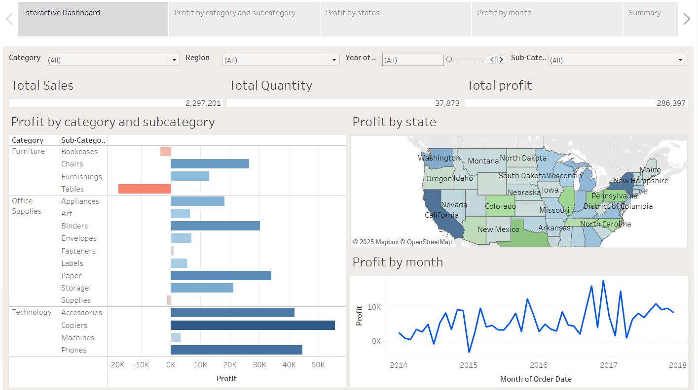

# Super Store Tableau Dashboard

## Overview
-This Tableau dashboard offers a clear and insightful look into profit trends across various areas, including:

-Profit by Category and Sub-Category: Easily spot which product segments are performing well and which need attention.

-Profit by States: Understand how profits are spread across different states to evaluate regional success.

-Profit by Months: See how profitability changes throughout the year and identify seasonal trends.

## Dashboard Preview
  

## Features
-Interactive Visualizations: Dive deeper into the data using filters for a more personalized view.

-Business Intelligence: Make smarter decisions by identifying what’s working and where improvements are needed.

-Trend Analysis: Track how profits shift over time and across different locations.

## Usage
1. Open the Tableau dashboard.
2. Use the filters to explore data by category, sub-category, state, or month.
3. Review the trends to help shape better business strategies.
   
## Acknowledgments
This dashboard was built to deliver meaningful insights into sales and profits, helping teams make smarter, data-backed decisions.

---
